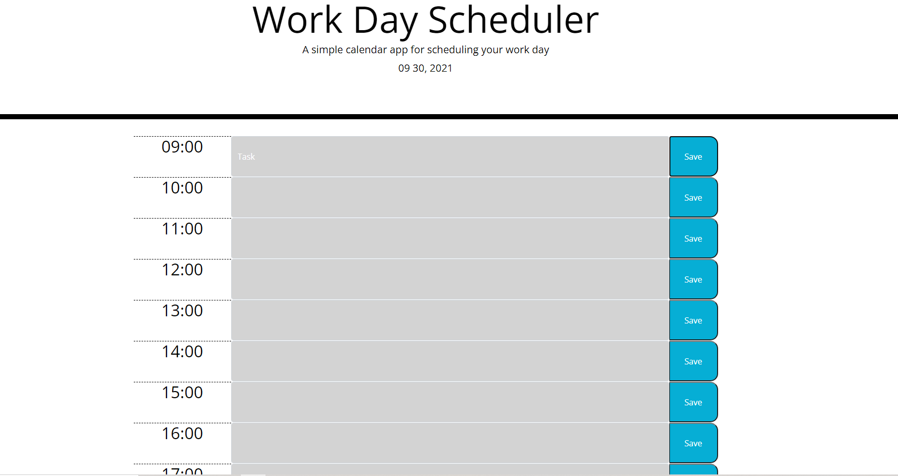

#Calender Apllication 
​
##General description here
​
This project is a small calender application to track tasks during work hours. It displays upcoming hour blocks in military time with the option to save to local storage and recall those tasks while tracking real time.  
-jQuery
-Css
-Bootstrap
-HTML
​
###Deployed link: 
​
​

​
## Technologies
​
Project is created with:
​
-jQuery
-Css
-Bootstrap
-HTML

## Deployment
​
​https://ghmurphy2.github.io/Calender-App/

## Code Overview
​
This apllication using javascript to populate a page with one hour blocks in which text can be saved 
​

## Authors
​
- Gavin Murphy
​
## License
​
- Open Source
